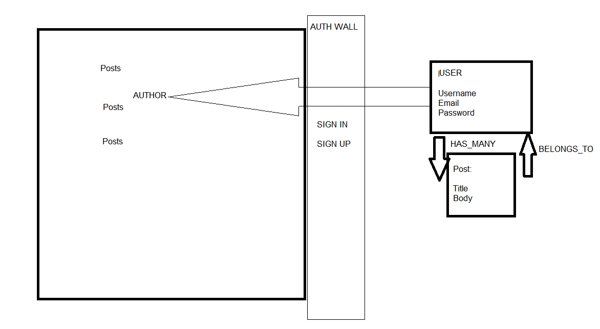
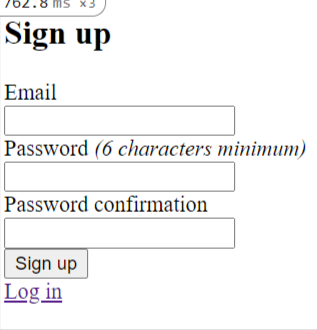
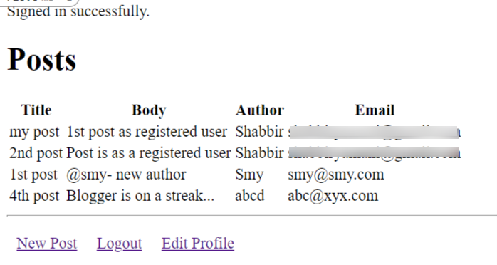
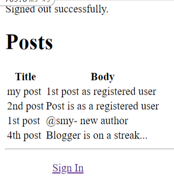

# Project : Members-Only

> The project builds on the previously learnt concepts of Devise Gem & Rails DB properties like belongs_to and has_many. Authentication and anonymous posts & privacy for anonymous posts vs known authors posts for authenticated in user.






## Built With

- Ruby on Rails
- Active Records
- Devise Gem
- Forms & Helpers
## Getting Started

Model generated:

- User
 - Create
 - Edit
 - Delete
 - HAS_MANY: Posts
 - Add Posts
 - Edit Posts
- Authentication
 - Login
  - View Posts Author info
 - Logout
  - Cannot View Posts Author info


### Requirements
- 1. Ruby (~v2.6.3 or more recent) installed in your machine.
- 2. Rails

### Setup

* To clone this repository, open your Terminal and execute the following command:
```
git clone https://github.com/smy5152/members-only.git
```

### Run
* Change into the folder
```
cd members-only
```
* Install gems
```
bundle install
```
* Run Database migrations
```
rails db:migrate
```

### How to use it

* Run Rails console
```
rails console
```

> To start testing the models, execute the following commands from the Rails console.
> We have added some default content in each Model.

- User.all
- Post.all

## Authors

🧑‍💻 **Shabbir**

- GitHub: [@smy5152](https://github.com/smy5152)
- Twitter: [@smy5152](https://twitter.com/smy5152)
- LinkedIn: [Shabbir Yamani](https://www.linkedin.com/in/shabbirmyamani/)

🧑‍💻 **Miguel**

- GitHub: [@smy5152](https://github.com/smy5152)
- Twitter: [@smy5152](https://twitter.com/smy5152)
- LinkedIn: [Shabbir Yamani](https://www.linkedin.com/in/shabbirmyamani/)

## 🤝 Contributing

Contributions, issues, and feature requests are welcome!
## Show your support

Give a ⭐️ if you like this project!

## Acknowledgments

- [Micoverse team](https://microverse.pathwright.com/library/fast-track-curriculum/69047/path/step/49722686/)

## 📝 License

This project is [MIT](LICENSE) licensed.
